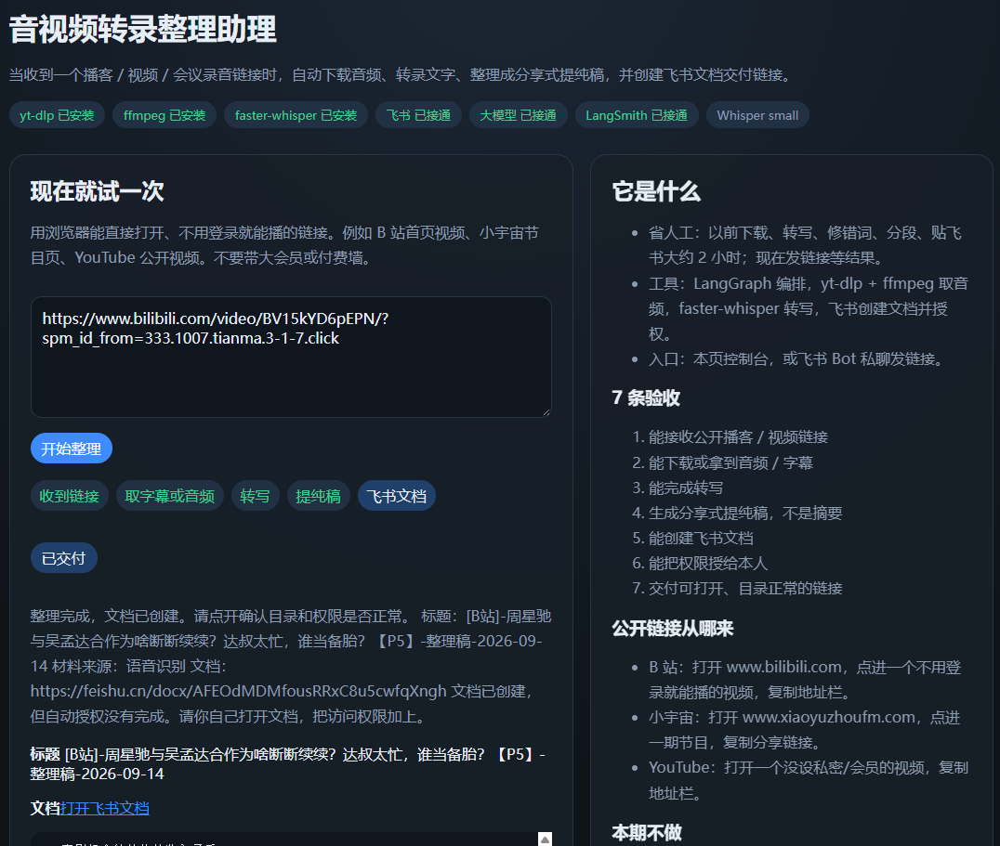
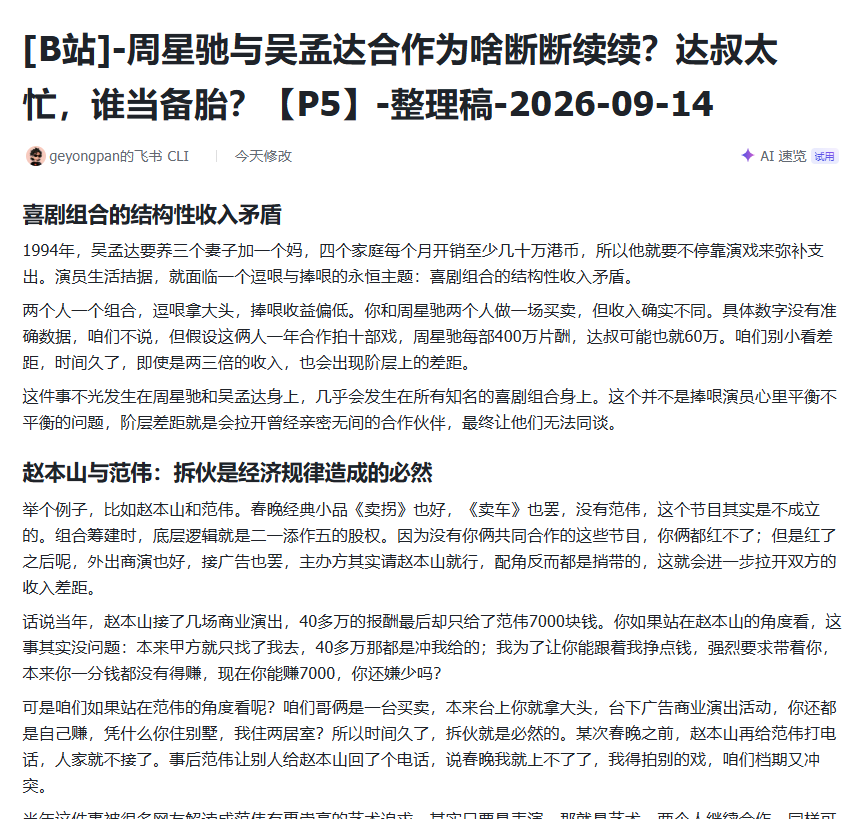

<p align="center">
  
</p>

<p align="center">
  
</p>

# 小 D · LangGraph

飞书入口的音视频转录整理 Agent。用 LangChain / LangGraph 编排，用 Vue + FastAPI 做本机控制台，用 LangSmith 按节点打点。

发给控制台或飞书机器人一条公开链接：小宇宙 / YouTube / B 站 / 本地音频 → 分享式提纯稿 → 飞书文档，并把权限授给发信人。

整理稿不是摘要。字幕优先，没有字幕再用本机 `faster-whisper`。

## 准备

在仓库根目录操作：

1. 复制 `.env.example` 为 `.env`，填 LangSmith、DeepSeek、飞书应用。
2. `uv sync --extra dev` 会装上 **yt-dlp** 和 **faster-whisper**。
3. 本机安装 [ffmpeg](https://ffmpeg.org/)，或把可执行文件路径写到 `.env` 的 `FFMPEG_BIN`。
4. `uv run xiaod doctor` 确认 yt-dlp、ffmpeg、faster-whisper 都在。
5. 飞书企业自建应用：开通事件订阅 WebSocket，订阅 `im.message.receive_v1`，开通云文档、协作者、发消息权限，并发布。

```bash
uv sync --extra dev
uv run xiaod doctor
```

Windows 复制环境文件：`copy .env.example .env`。macOS / Linux：`cp .env.example .env`。

## 命令

在仓库根目录执行：

```bash
uv run xiaod doctor         # 检查 yt-dlp / ffmpeg / faster-whisper
uv run xiaod hello          # 写一条 LangSmith hello trace
uv run xiaod eval           # 本地规则评估（分类 + 文稿门禁）
uv run xiaod run "请转录 https://www.xiaoyuzhoufm.com/episode/..."
uv run xiaod web            # FastAPI 控制台，默认 http://127.0.0.1:8765
uv run xiaod bot            # 飞书长连接，本机无需公网
```

前端开发页：

```bash
cd web
npm install
npm run dev
```

浏览器打开 `http://127.0.0.1:5173`。开发时 Vite 会把 `/api` 转到 FastAPI。先要另开一个终端跑 `uv run xiaod web`。

打包给 FastAPI 直接托管：

```bash
cd web
npm run build
```

回到仓库根目录后再执行 `uv run xiaod web`。

## 验收

能收链接、能拿到音频或字幕、能转写、是提纯稿不是要点、能建飞书文档、能授权给本人、链接可打开。

小红书 / 抖音 / 公众号 / 视频号 / 飞书妙记本期不处理。

## 监测

`LANGSMITH_TRACING=true` 且填了 `LANGSMITH_API_KEY` 后，整图自动进项目 `xiaod`。yt-dlp / whisper / 飞书调用带 `@traceable`。密钥会脱敏。
