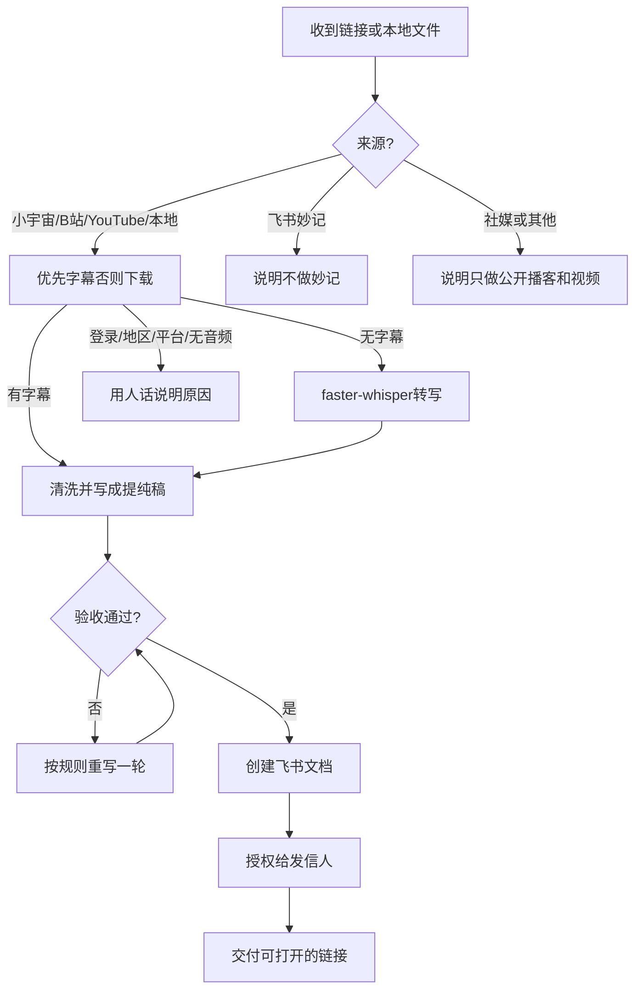

这张图对应音视频整理闭环，用来检查路由和飞书交付是否完整。

```mermaid
flowchart TD
  start[收到链接或本地文件] --> classify{来源?}
  classify -->|小宇宙/B站/YouTube/本地| fetch[优先字幕否则下载]
  classify -->|飞书妙记| refuseMinutes[说明不做妙记]
  classify -->|社媒或其他| humanOut[说明只做公开播客和视频]
  fetch -->|有字幕| purify[清洗并写成提纯稿]
  fetch -->|无字幕| asr[faster-whisper转写]
  fetch -->|登录/地区/平台/无音频| failDownload[用人话说明原因]
  asr --> purify
  purify --> qa{验收通过?}
  qa -->|否| rewrite[按规则重写一轮]
  rewrite --> qa
  qa -->|是| doc[创建飞书文档]
  doc --> acl[授权给发信人]
  acl --> deliver[交付可打开的链接]
```
